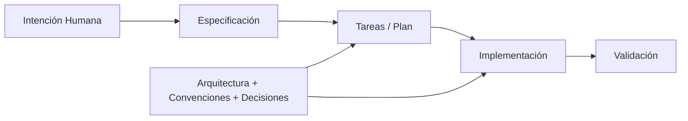
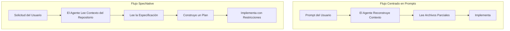
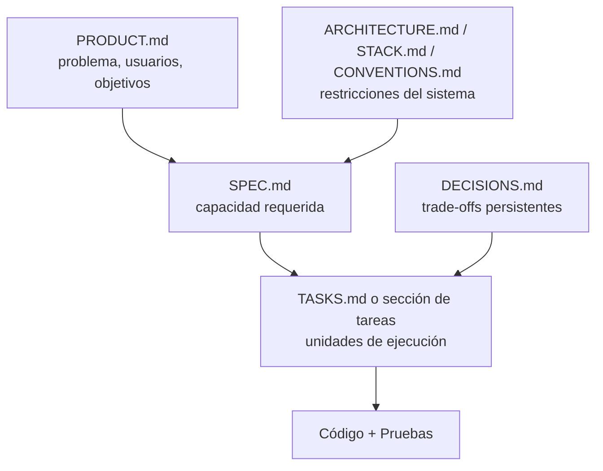
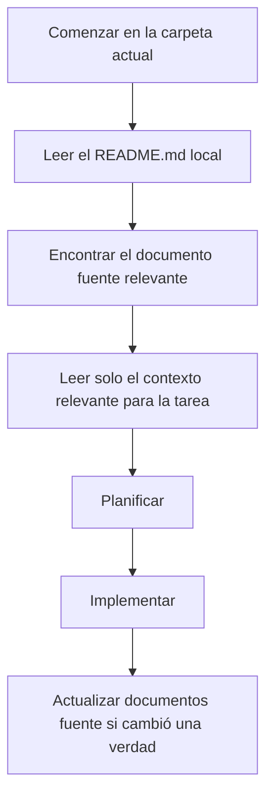
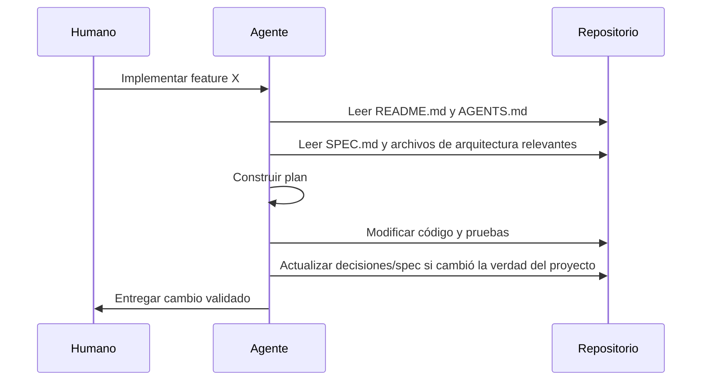
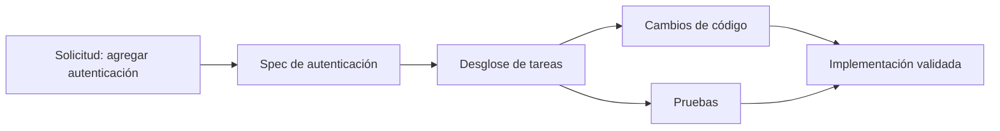

# SpecNative Development

Desarrollo estructurado por repositorio y orientado por especificaciones para agentes de IA y humanos.

## Vista Previa v0.3

El repositorio ya incluye una propuesta concreta `v0.3` del framework en
[`Template-Project-Agents-AI`](./Template-Project-Agents-AI). Esta revision agrega las
piezas que llevan el framework desde una estructura legible hacia tooling exportable:

- un contrato explicito del framework en [`SCHEMA.md`](./Template-Project-Agents-AI/agents/SCHEMA.md)
- modelos de estado obligatorios para specs, tareas y decisiones
- una capa de trazabilidad en [`TRACEABILITY.md`](./Template-Project-Agents-AI/agents/TRACEABILITY.md)
- una capa de ejecucion de primera clase en [`tasks/`](./Template-Project-Agents-AI/tasks)
- procedimientos repetibles en [`workflows/`](./Template-Project-Agents-AI/workflows)
- metadata TOML parseable en specs y archivos de tareas
- una CLI en Python en [`specnative.py`](./Template-Project-Agents-AI/tools/specnative.py) para validar y exportar
- un ejemplo end-to-end de autenticacion

Con esto la propuesta se acerca mas a un protocolo que a un patron documental suelto.

## Resumen Ejecutivo

SpecNative Development se entiende mejor como un cambio en el lugar donde vive el contexto del proyecto.

En un flujo centrado en prompts, el agente depende de instrucciones en tiempo de ejecución, historial de chat y descubrimiento ad hoc de archivos para decidir qué construir. En un flujo SpecNative, el repositorio ya contiene la intención del producto, los límites arquitectónicos, las convenciones y las especificaciones activas en ubicaciones estables. El prompt pasa a ser un disparador de trabajo, no el contenedor principal del conocimiento del proyecto.

La propuesta práctica de este repositorio es simple:

- guardar el conocimiento duradero del proyecto en archivos versionados
- organizar esos archivos para que los agentes puedan descubrirlos de forma predecible
- derivar la implementación desde especificaciones en lugar de reconstruir contexto en cada ejecución

Para un ingeniero que descubre este proyecto por primera vez, la idea central no es "usar más IA". La idea central es "estructurar el repositorio para que la IA pueda razonar sobre el proyecto de la misma forma que lo haría un ingeniero".

## Concepto de un Vistazo



El diagrama anterior resume el modelo:

- la intención se convierte en una especificación
- la especificación se descompone en tareas
- las tareas impulsan la implementación
- la arquitectura y las convenciones restringen el plan y el código
- la validación comprueba el resultado contra la especificación

## Por Qué Existe Este Repositorio

Este repositorio es una plantilla y un modelo de referencia para equipos que quieren que el desarrollo asistido por IA sea más repetible.

No propone un nuevo lenguaje de programación, runtime de agentes ni protocolo de orquestación. Propone una disciplina de repositorio:

- los archivos `README.md` son índices de navegación
- los documentos estructurados almacenan el contexto duradero
- los agentes leen el mínimo contexto relevante antes de actuar
- las verdades compartidas se actualizan en documentos fuente en lugar de repetirse en prompts

## Problema

Hoy el desarrollo asistido por IA está dominado por la construcción de prompts en tiempo de ejecución. Ese modelo funciona para tareas cortas y aisladas, pero se degrada cuando los proyectos son más grandes, duraderos y colaborativos.

Los principales fallos son estructurales:

- La ingeniería de prompts no escala. A medida que crece el alcance del proyecto, las instrucciones se vuelven más largas, más frágiles y más difíciles de mantener consistentes entre sesiones, contribuyentes y runtimes de agentes.
- Los agentes no tienen contexto persistente. Decisiones arquitectónicas importantes, restricciones del dominio y límites de tareas suelen reexplicarse en cada interacción en lugar de almacenarse en el repositorio como contexto duradero.
- Los repositorios rara vez están organizados para el razonamiento de IA. La mayoría de los codebases están optimizados para layout de código fuente, no para navegación incremental por máquina, seguimiento de decisiones o consulta de especificaciones.
- Repetir el contexto desperdicia tiempo y tokens. Los equipos invierten esfuerzo en restablecer la intención del producto, las restricciones y las convenciones en lugar de codificarlas una sola vez como parte de la estructura del proyecto.

Muchos enfoques actuales, incluidos los prompts ad hoc y los frameworks de agentes, siguen dependiendo en gran medida del ensamblado de contexto en tiempo de ejecución. El agente recibe instrucciones durante la ejecución y luego reconstruye la intención desde prompts, historial de chat y lecturas parciales de archivos. El repositorio sigue siendo mayormente pasivo. SpecNative Development invierte ese modelo: el repositorio se convierte en el sistema principal de contexto y los prompts pasan a ser una entrada delgada, no la fuente de verdad.

### Flujo Centrado en Prompts vs Flujo Centrado en Repositorio



La diferencia no es que los prompts desaparezcan. La diferencia es que dejan de cargar con todo el estado del proyecto.

## Qué Es SpecNative Development

SpecNative Development es un enfoque de desarrollo en el que el repositorio se organiza como el contexto principal de ejecución para la implementación asistida por IA.

En este modelo:

- El repositorio se convierte en la fuente principal de contexto.
- Las especificaciones definen qué debe construirse.
- Los documentos de arquitectura definen restricciones y límites permitidos del sistema.
- Las tareas representan unidades ejecutables derivadas de las especificaciones.
- La implementación sigue esos artefactos en lugar de depender de prompts largos en lenguaje natural.

El objetivo no es eliminar los prompts por completo. El objetivo es hacerlos más superficiales y deterministas porque la intención del proyecto ya existe en archivos versionados.

La relación central es:

1. Las especificaciones describen el comportamiento requerido y los criterios de aceptación.
2. La arquitectura describe la forma del sistema, sus límites y sus restricciones.
3. Las tareas descomponen las especificaciones en pasos concretos de implementación.
4. La implementación materializa esas tareas en código y pruebas.

Esto crea un flujo donde los agentes leen archivos estructurados del proyecto, construyen planes a partir de entradas duraderas y producen cambios reproducibles. Cuanto más codifica el repositorio la intención, menos depende el resultado de la redacción puntual de un prompt.

### Modelo de Información



Esta es la dirección de dependencia prevista:

- el contexto de producto influye en qué debe existir
- la arquitectura restringe cómo puede existir
- las decisiones preservan trade-offs previos
- las especificaciones definen un cambio concreto
- las tareas descomponen ese cambio en trabajo implementable
- el código y las pruebas materializan el resultado

## Principios Base

SpecNative Development se apoya en un conjunto pequeño de principios de ingeniería.

- Desarrollo specification-first. El comportamiento se define antes de la implementación y las especificaciones se tratan como contexto ejecutable para humanos y agentes.
- El repositorio como contexto del agente. El conocimiento duradero del proyecto vive en archivos, no en historial transitorio de chat.
- Flujos deterministas. Los agentes deberían poder entrar al repositorio, descubrir los documentos relevantes y llegar a conclusiones similares a partir de las mismas entradas.
- Separación de responsabilidades. Las especificaciones legibles por humanos, las restricciones arquitectónicas, las decisiones y los comandos operativos se almacenan por separado para que cada documento tenga un propósito claro.
- Separación entre intención y ejecución. Las especificaciones describen qué y por qué; las tareas describen cómo se descompone el trabajo; el código implementa el resultado.
- Dependencias mínimas en runtime. El enfoque no requiere un runtime de agentes, plataforma de orquestación o framework propietario específicos para ser útil.
- Fuente única de verdad. Los hechos deberían existir en un único documento autoritativo en lugar de repetirse entre prompts, tickets y notas locales.

## Estructura del Repositorio

Este repositorio incluye una plantilla mínima en [`Template-Project-Agents-AI`](./Template-Project-Agents-AI) que demuestra el enfoque. En la plantilla incluida, la mayor parte del contexto del repositorio vive bajo `agents/`, con archivos `README.md` actuando como índices de navegación y archivos en mayúsculas actuando como fuentes duraderas de contexto.

La plantilla incluye actualmente:

- `AGENTS.md`: contrato operativo de agentes para el repositorio.
- `agents/README.md`: índice del sistema de contexto del proyecto.
- `agents/PRODUCT.md`: problema de producto, usuarios, objetivos y alcance.
- `agents/ARCHITECTURE.md`: estructura del sistema, límites y riesgos.
- `agents/STACK.md`: restricciones tecnológicas y de plataforma.
- `agents/CONVENTIONS.md`: reglas de implementación y documentación.
- `agents/COMMANDS.md`: comandos operativos para setup, pruebas y entrega.
- `agents/ROADMAP.md`: contexto de dirección y prioridades.
- `agents/DECISIONS.md`: registro persistente de decisiones.
- `agents/SPEC.md`: especificación activa o general.
- `agents/specs/`: índice y almacenamiento para especificaciones por iniciativa.

El modelo más amplio de SpecNative puede representarse con directorios dedicados como `specs/`, `tasks/`, `architecture/` y `workflows/`. En muchos proyectos esas responsabilidades pueden existir como carpetas de primer nivel. En esta plantilla están colapsadas intencionalmente en una estructura más pequeña para simplificar la adopción sin perder el mismo modelo de información.

Para una primera lectura, la distinción importante es:

- los documentos de navegación le dicen al agente dónde mirar después
- los documentos de contexto definen la verdad del proyecto que el agente debe respetar

Ejemplo de layout derivado:

```text
repo/
├── AGENTS.md
├── README.md
├── agents/
│   ├── README.md
│   ├── PRODUCT.md
│   ├── ROADMAP.md
│   ├── DECISIONS.md
│   └── specs/
│       ├── README.md
│       └── authentication/
│           ├── README.md
│           ├── SPEC.md
│           └── TASKS.md
├── architecture/
│   ├── README.md
│   ├── ARCHITECTURE.md
│   ├── STACK.md
│   └── CONVENTIONS.md
├── tasks/
│   ├── README.md
│   └── authentication/
│       └── TASKS.md
└── workflows/
    ├── README.md
    └── implementation.md
```

Propósito de las áreas principales:

- `agents/`: punto de entrada para la navegación humana y de agentes. Explica cómo encontrar los documentos fuente correctos cargando el mínimo contexto posible.
- `specs/`: definiciones de capacidades, criterios de aceptación y alcance. En la plantilla actual este rol lo cumplen `agents/SPEC.md` y `agents/specs/`.
- `tasks/`: descomposición ejecutable de specs en unidades de implementación, checkpoints y pasos de validación. Es una extensión natural para equipos que necesitan seguimiento de ejecución más formal.
- `architecture/`: límites del sistema, restricciones de stack, convenciones y registros de decisiones. En la plantilla actual estos documentos viven bajo `agents/`.
- `workflows/`: procedimientos operativos repetibles para planificación, implementación, validación, release o coordinación multiagente.

### Estrategia de Lectura

Un agente no debería leer todo el repositorio por defecto. Debería navegar.



Esto mantiene acotada la carga de contexto y hace que el repositorio sea más operable para humanos y agentes.

## Cómo Interactúan los Agentes con el Repositorio

El flujo previsto del agente es directo:

1. Leer el contexto del repositorio empezando por el `README.md` más cercano y `AGENTS.md`.
2. Leer la especificación activa o la especificación relevante de la iniciativa.
3. Leer restricciones arquitectónicas, convenciones, reglas de stack y decisiones registradas.
4. Generar un plan de implementación a partir de esos documentos.
5. Ejecutar tareas y validar el resultado contra la especificación.

Esto importa porque el repositorio reemplaza la repetición del contexto en prompts. En vez de decirle a un agente en cada ejecución cómo funciona el producto, dónde están los límites, qué convenciones de naming seguir y qué trade-offs ya fueron tomados, esos hechos quedan codificados en archivos con ubicaciones estables y ownership explícito.

En la práctica, los prompts se vuelven más cortos y más mecánicos. Un humano puede decir "implementa la spec de autenticación" porque el repositorio ya define qué significan "autenticación", "implementar" y "terminado" en ese proyecto.

### Bucle de Ejecución del Agente



## Cómo Usar la Plantilla

La plantilla está pensada para copiarse en un repositorio nuevo o adaptarse dentro de un codebase existente.

1. Clona o copia la plantilla en tu proyecto.
2. Define la arquitectura del proyecto en los documentos de contexto. Como mínimo, completa intención de producto, límites del sistema, restricciones de stack, convenciones y comandos operativos.
3. Define una o más especificaciones. Empieza con `agents/SPEC.md` para una sola iniciativa activa y luego mueve trabajo más grande a `agents/specs/<initiative>/`.
4. Crea tareas a partir de la especificación. Pueden codificarse directamente en la spec, en un archivo `TASKS.md` o en un área dedicada `tasks/` si tu proyecto necesita seguimiento más estricto.
5. Permite que los agentes implementen código a partir de esos artefactos en lugar de usar prompts extensos y personalizados.
6. Actualiza decisiones y documentos de contexto cuando cambie la verdad del proyecto.

Si estás adoptando la plantilla en un codebase existente, el orden de migración recomendado es:

1. agregar `AGENTS.md` y un `README.md` raíz que definan la navegación
2. crear los documentos base de contexto bajo `agents/`
3. mover una iniciativa activa a `SPEC.md`
4. usar esa iniciativa para probar el flujo antes de escalar el patrón

La colaboración entre humanos y agentes es explícita:

- Los humanos definen el problema, las restricciones y los criterios de aceptación.
- Los agentes leen esos artefactos, planifican el trabajo e implementan dentro de los límites declarados.
- Los humanos revisan resultados y actualizan especificaciones o decisiones cuando cambian los supuestos.

El cambio importante es que la colaboración ocurre a través de estado versionado del repositorio, no solo mediante estado conversacional.

## Flujo de Ejemplo

Considera la solicitud: agregar autenticación al sistema.

En un flujo convencional centrado en prompts, esa solicitud suele convertirse en un prompt largo con supuestos de producto, restricciones de sesión, decisiones tecnológicas y preferencias de implementación.

En SpecNative Development, el mismo cambio se representa estructuralmente:



### Spec

`SPEC.md` o `agents/specs/authentication/SPEC.md` define:

- el problema de autenticación que se está resolviendo
- los flujos de usuario soportados
- los requisitos de seguridad
- los no objetivos
- los criterios de aceptación
- los requisitos de validación

### Tareas

Un desglose de tareas correspondiente define trabajo ejecutable como:

- agregar integración con proveedor de identidad
- implementar manejo de sesión
- agregar middleware de autorización
- actualizar modelo de usuario y persistencia
- agregar pruebas de integración y end-to-end
- documentar setup operativo

### Implementación

El agente luego lee:

- contexto de producto desde `PRODUCT.md`
- restricciones arquitectónicas desde `ARCHITECTURE.md`
- restricciones de stack desde `STACK.md`
- reglas de código desde `CONVENTIONS.md`
- comandos de ejecución desde `COMMANDS.md`
- la especificación de autenticación y su lista de tareas

A partir de ahí puede producir un plan e implementar código con menos ambigüedad. El repositorio ya responde la mayoría de las preguntas que de otro modo quedarían embebidas en un prompt.

Una descomposición representativa se vería así:

| Capa | Artefacto de ejemplo | Propósito |
| --- | --- | --- |
| Contexto de producto | `PRODUCT.md` | Explica por qué se necesita autenticación y para quién |
| Arquitectura | `ARCHITECTURE.md` | Define dónde puede vivir la lógica de identidad, sesión y autorización |
| Especificación | `SPEC.md` | Declara el comportamiento requerido como login, logout y control de acceso |
| Tareas | `TASKS.md` o sección de tareas | Descompone la spec en unidades de implementación |
| Implementación | código fuente y pruebas | Entrega el comportamiento y lo valida |

## Comparación con Otros Enfoques

| Enfoque | Fuente principal de contexto | Fortalezas | Trade-offs |
| --- | --- | --- | --- |
| Prompt Engineering | Prompts en runtime e historial de chat | Rápido para tareas aisladas, bajo costo inicial | El contexto es transitorio, difícil de escalar y sensible a la redacción del prompt |
| Agent Frameworks | Orquestación en runtime más contexto recuperado | Útiles para tool calling y ejecución multi-step | A menudo siguen dependiendo de ensamblado dinámico de contexto en vez de estructura nativa del repositorio |
| SpecNative Development | Estructura versionada del repositorio y especificaciones | Mayor determinismo, contexto reutilizable y límites de colaboración más claros | Requiere disciplina documental y mantenimiento del repositorio |

SpecNative Development no reemplaza todos los enfoques basados en prompts o frameworks. Es un sistema de restricciones para hacer esos enfoques más confiables. Los equipos siguen necesitando buenas herramientas y buen criterio de ingeniería, pero invierten menos esfuerzo en reconstruir contexto durante la ejecución.

El trade-off es explícito: este enfoque incrementa la disciplina del repositorio a cambio de menor ambigüedad en runtime.

## Cuándo Usar SpecNative Development

Este enfoque es más útil cuando:

- el coding asistido por IA es parte regular del flujo de desarrollo
- el codebase es lo suficientemente grande como para que repetir contexto resulte costoso
- múltiples agentes o contribuyentes necesitan trabajar con los mismos supuestos arquitectónicos
- importan los flujos deterministas y auditables
- el equipo quiere que la historia del repositorio preserve no solo código, sino también intención, decisiones y contexto de ejecución

Es menos necesario para prototipos muy pequeños y de vida corta donde el costo de mantener contexto estructurado supera el valor de reutilizarlo.

Es especialmente útil cuando los ingenieros quieren revisar no solo los cambios de código, sino también la superficie de razonamiento que los produjo.

## Objetivos del Proyecto

La plantilla busca soportar un proceso más disciplinado de desarrollo AI-native.

Sus objetivos son:

- reducir la complejidad de los prompts moviendo el contexto duradero a archivos del repositorio
- mejorar el determinismo de los agentes mediante estructura explícita y ownership documental
- facilitar que los agentes naveguen repositorios sin instrucciones personalizadas
- estandarizar flujos de implementación guiados por especificaciones
- preservar intención arquitectónica y de producto en control de versiones

## Evolución Futura

Direcciones posibles para el enfoque:

- modelos de orquestación de agentes guiados por estado del repositorio
- esquemas estandarizados de repositorio para especificaciones, tareas y decisiones
- pipelines de planificación automatizada generados a partir de specs y documentos de arquitectura
- capas de compatibilidad con distintos runtimes de agentes y asistentes de código
- flujos de validación más ricos que conecten specs directamente con pruebas y delivery gates

Este repositorio debe entenderse como una plantilla mínima, no como un estándar terminado. Su valor está en hacer el modelo lo bastante concreto como para probarlo, criticarlo y evolucionarlo.

## Contribuir

Las contribuciones son útiles tanto como cambios de código como feedback metodológico.

Si quieres contribuir:

- adapta la plantilla a un proyecto real y documenta qué funcionó y qué falló
- propone mejoras estructurales al modelo de repositorio
- sugiere límites documentales o convenciones de nombres más claros
- agrega ejemplos que muestren cómo las especificaciones se transforman en tareas e implementación
- cuestiona supuestos cuando el enfoque introduzca complejidad innecesaria

Este repositorio está pensado como un artefacto de ingeniería para experimentación. El feedback práctico basado en uso real vale más que la adhesión abstracta.

## Licencia

La información de licencia será agregada por los maintainers del proyecto.
