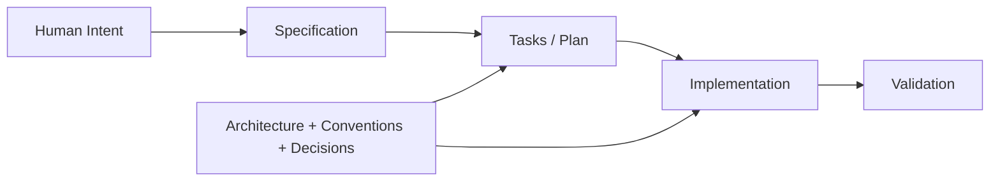
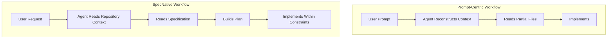
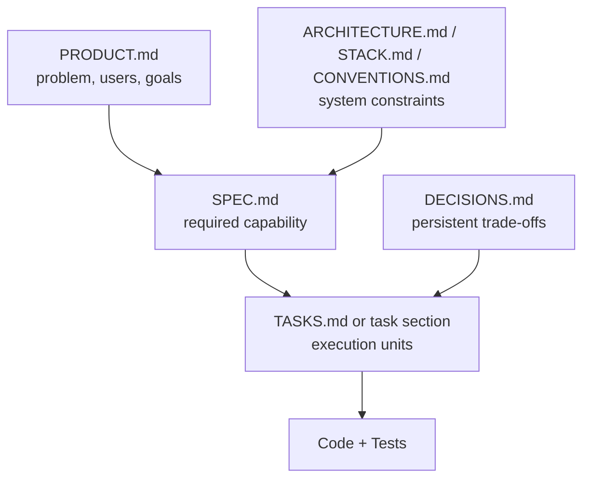
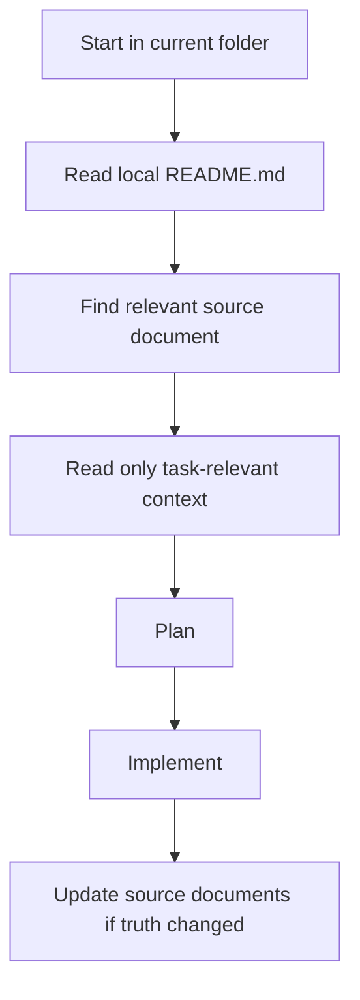
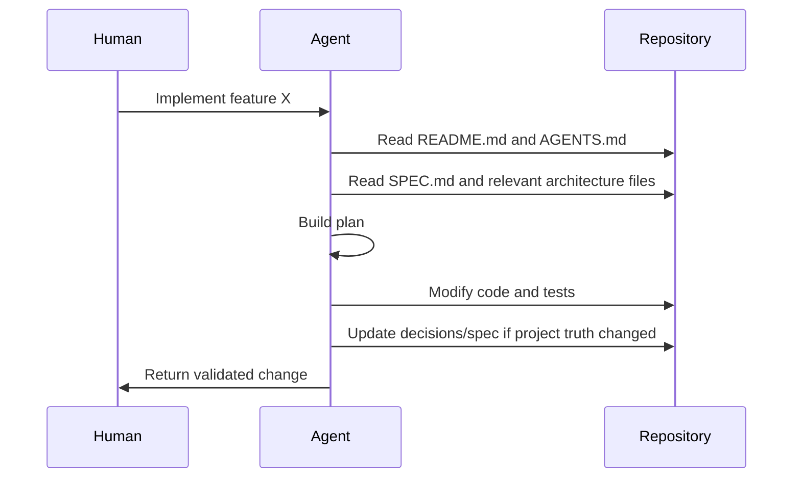
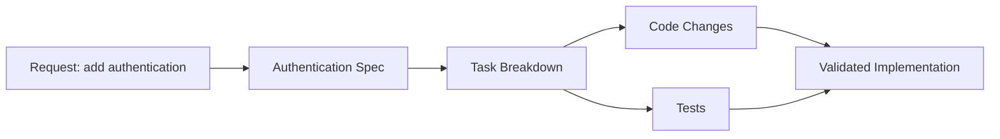

# SpecNative Development

Repository-structured, specification-first development for AI agents and humans.

## v0.2 Preview

The current repository now includes a concrete `v0.2` proposal of the framework in
[`Template-Project-Agents-AI`](./Template-Project-Agents-AI). This revision adds the pieces
that were previously implicit:

- an explicit framework contract in [`SCHEMA.md`](./Template-Project-Agents-AI/agents/SCHEMA.md)
- required state models for specs, tasks, and decisions
- a traceability layer in [`TRACEABILITY.md`](./Template-Project-Agents-AI/agents/TRACEABILITY.md)
- a first-class execution layer in [`tasks/`](./Template-Project-Agents-AI/tasks)
- repeatable operating procedures in [`workflows/`](./Template-Project-Agents-AI/workflows)
- a structural validator in [`validate-specnative.sh`](./Template-Project-Agents-AI/tools/validate-specnative.sh)
- an end-to-end example initiative for authentication

This makes the proposal closer to a protocol than a loose documentation pattern.

## Executive Summary

SpecNative Development is easiest to understand as a change in where project context lives.

In a prompt-centric workflow, the agent depends on runtime instructions, chat history, and ad hoc file discovery to decide what to build. In a SpecNative workflow, the repository already contains the product intent, architectural boundaries, conventions, and active specifications in stable locations. The prompt becomes a trigger for work, not the main container of project knowledge.

The practical claim of this repository is simple:

- put durable project knowledge in versioned files
- organize those files so agents can discover them predictably
- derive implementation from specifications instead of rebuilding context on every run

For an engineer encountering this project for the first time, the core idea is not "use more AI." The core idea is "structure the repository so AI can reason about the project the same way an engineer would."

## Concept At a Glance



The diagram above is the working model:

- intent becomes a specification
- the specification is decomposed into tasks
- tasks drive implementation
- architecture and conventions constrain the plan and the code
- validation checks the result against the specification

## Why This Repository Exists

This repository is a template and reference model for teams that want AI-assisted development to be more repeatable.

It does not propose a new programming language, agent runtime, or orchestration protocol. It proposes a repository discipline:

- `README.md` files are navigation indexes
- structured documents store durable context
- agents read the minimum relevant context before acting
- shared truths are updated in source documents instead of being repeated in prompts

## Problem Statement

AI-assisted development is currently dominated by runtime prompt construction. That model works for short, isolated tasks, but it degrades as projects become larger, longer-lived, and more collaborative.

The main failure modes are structural:

- Prompt engineering does not scale. As project scope grows, instructions become longer, more fragile, and harder to keep consistent across sessions, contributors, and agent runtimes.
- Agents lack persistent context. Important architectural decisions, domain constraints, and task boundaries are often re-explained in every interaction instead of being stored in the repository as durable context.
- Repositories are rarely organized for AI reasoning. Most codebases are optimized for source layout, not for incremental machine navigation, decision tracking, or specification lookup.
- Repeated context explanation wastes time and tokens. Teams spend effort restating the same product intent, constraints, and conventions instead of encoding them once as part of the project structure.

Many current approaches, including ad hoc prompting and agent frameworks, still depend heavily on runtime context assembly. The agent receives instructions at execution time, then reconstructs intent from prompts, chat history, and partial file reads. The repository remains mostly passive. SpecNative Development inverts that model: the repository becomes the primary context system, and prompts become a thin entry point rather than the source of truth.

### Prompt-Centric vs Repository-Centric



The difference is not that prompts disappear. The difference is that prompts stop carrying the full project state.

## What Is SpecNative Development

SpecNative Development is a development approach in which the repository itself is organized as the primary execution context for AI-assisted implementation.

In this model:

- The repository becomes the primary source of context.
- Specifications define what must be built.
- Architecture documents define constraints and allowed system boundaries.
- Tasks represent executable units derived from specifications.
- Implementation follows those artifacts rather than relying on long natural-language prompts.

The goal is not to eliminate prompts entirely. The goal is to make prompts shallow and deterministic because the project intent already exists in versioned files.

The core relationship is:

1. Specifications describe required behavior and acceptance criteria.
2. Architecture describes system shape, boundaries, and constraints.
3. Tasks decompose specifications into concrete implementation steps.
4. Implementation realizes those tasks in code and tests.

This creates a workflow where agents read structured project files, build plans from durable inputs, and produce reproducible changes. The more the repository encodes intent, the less the outcome depends on session-specific prompt wording.

### Information Model



This is the intended dependency direction:

- product context influences what should exist
- architecture constrains how it can exist
- decisions preserve prior trade-offs
- specs define a concrete change
- tasks decompose that change into implementable work
- code and tests realize the result

## Core Principles

SpecNative Development is built around a small set of engineering principles.

- Specification-first development. Behavior is defined before implementation, and specifications are treated as executable context for both humans and agents.
- Repository as agent context. Durable project knowledge lives in files, not in transient chat history.
- Deterministic workflows. Agents should be able to enter the repository, discover the relevant documents, and reach similar conclusions from the same inputs.
- Separation of concerns. Human-readable specifications, architectural constraints, decisions, and operational commands are stored separately so each document has a clear purpose.
- Separation between intent and execution. Specifications describe what and why; tasks describe how work is broken down; code implements the result.
- Minimal runtime dependencies. The approach does not require a specific agent runtime, orchestration platform, or proprietary framework in order to be useful.
- Single source of truth. Facts should exist in one authoritative document rather than being repeated across prompts, tickets, and local notes.

## Repository Structure

This repository includes a minimal template under [`Template-Project-Agents-AI`](./Template-Project-Agents-AI) that demonstrates the approach. In the shipped template, most repository context is hosted under `agents/`, with `README.md` files acting as navigational indexes and uppercase files acting as durable context sources.

The template currently includes:

- `AGENTS.md`: agent operating contract for the repository.
- `agents/README.md`: index to the project context system.
- `agents/PRODUCT.md`: product problem, users, goals, and scope.
- `agents/ARCHITECTURE.md`: system structure, boundaries, and risks.
- `agents/STACK.md`: technology and platform constraints.
- `agents/CONVENTIONS.md`: implementation and documentation rules.
- `agents/COMMANDS.md`: operational commands for setup, testing, and delivery.
- `agents/ROADMAP.md`: directional planning context.
- `agents/DECISIONS.md`: persistent decision log.
- `agents/SPEC.md`: active or general specification.
- `agents/specs/`: index and storage for initiative-specific specifications.

The broader SpecNative model can be represented with dedicated directories such as `specs/`, `tasks/`, `architecture/`, and `workflows/`. In many projects those concerns may exist as top-level folders. In this template they are intentionally collapsed into a smaller structure to keep adoption simple while preserving the same information model.

For a first reading, the important distinction is:

- navigation documents tell an agent where to look next
- context documents define the project truth the agent must respect

Example derived layout:

```text
repo/
├── AGENTS.md
├── README.md
├── agents/
│   ├── README.md
│   ├── PRODUCT.md
│   ├── ROADMAP.md
│   ├── DECISIONS.md
│   └── specs/
│       ├── README.md
│       └── authentication/
│           ├── README.md
│           ├── SPEC.md
│           └── TASKS.md
├── architecture/
│   ├── README.md
│   ├── ARCHITECTURE.md
│   ├── STACK.md
│   └── CONVENTIONS.md
├── tasks/
│   ├── README.md
│   └── authentication/
│       └── TASKS.md
└── workflows/
    ├── README.md
    └── implementation.md
```

Purpose of the main areas:

- `agents/`: entry point for human and agent navigation. It explains how to find the right source documents with minimal context loading.
- `specs/`: capability definitions, acceptance criteria, and scope. In the current template this role is handled by `agents/SPEC.md` and `agents/specs/`.
- `tasks/`: executable decomposition of specs into implementation units, checkpoints, and validation steps. This is a natural extension for teams that need more formal execution tracking.
- `architecture/`: system boundaries, stack constraints, conventions, and decision records. In the current template these documents live under `agents/`.
- `workflows/`: repeatable operating procedures for planning, implementation, validation, release, or multi-agent coordination.

### Reading Strategy

An agent should not read the entire repository by default. It should navigate.



This keeps context loading bounded and makes the repository easier to operate for both humans and agents.

## How Agents Interact With the Repository

The intended agent workflow is straightforward:

1. Read repository context starting from the nearest `README.md` and `AGENTS.md`.
2. Read the active specification or the relevant initiative specification.
3. Read architecture constraints, conventions, stack rules, and recorded decisions.
4. Generate an implementation plan from those documents.
5. Execute tasks and validate the result against the specification.

This matters because the repository replaces repeated prompt restatement. Instead of telling an agent on every run how the product works, where the boundaries are, what naming conventions to follow, and which trade-offs were already made, those facts are encoded in files with stable locations and explicit ownership.

In practice, prompts become shorter and more mechanical. A human can say "implement the authentication spec" because the repository already defines what "authentication," "implement," and "done" mean in that project.

### Agent Execution Loop



## How To Use the Template

The template is intended to be copied into a new repository or adapted into an existing codebase.

1. Clone or copy the template into your project.
2. Define the project architecture in the context documents. At minimum, fill in product intent, system boundaries, stack constraints, conventions, and operational commands.
3. Define one or more specifications. Start with `agents/SPEC.md` for a single active initiative, then move larger work into `agents/specs/<initiative>/`.
4. Create tasks from the specification. These can be encoded directly in the spec, in a `TASKS.md` file, or in a dedicated `tasks/` area if your project needs stricter execution tracking.
5. Let agents implement code from those artifacts rather than from large bespoke prompts.
6. Update decisions and context files when the project truth changes.

If you are adopting the template in an existing codebase, the recommended migration order is:

1. add `AGENTS.md` and a root `README.md` that define navigation
2. create the core context documents under `agents/`
3. move one active initiative into `SPEC.md`
4. use that initiative to test the workflow before scaling the pattern

Human and agent collaboration is explicit:

- Humans define the problem, constraints, and acceptance criteria.
- Agents read those artifacts, plan work, and implement within the declared boundaries.
- Humans review outcomes and update specifications or decisions when assumptions change.

The important shift is that collaboration happens through versioned repository state, not only through conversational state.

## Example Workflow

Consider the change request: add authentication to the system.

In a conventional prompt-driven workflow, that request often becomes a long prompt containing product assumptions, session-specific constraints, technology choices, and implementation preferences.

In SpecNative Development, the same change is represented structurally:



### Spec

`SPEC.md` or `agents/specs/authentication/SPEC.md` defines:

- the authentication problem being solved
- supported user flows
- security requirements
- non-goals
- acceptance criteria
- validation requirements

### Tasks

A corresponding task breakdown defines executable work such as:

- add identity provider integration
- implement session handling
- add authorization middleware
- update user model and persistence
- add integration and end-to-end tests
- document operational setup

### Implementation

The agent then reads:

- product context from `PRODUCT.md`
- architectural constraints from `ARCHITECTURE.md`
- stack constraints from `STACK.md`
- coding rules from `CONVENTIONS.md`
- execution commands from `COMMANDS.md`
- the authentication specification and task list

From there it can produce a plan and implement code with less ambiguity. The repository already answers most of the questions that would otherwise be embedded in a prompt.

A representative decomposition would look like this:

| Layer | Example artifact | Purpose |
| --- | --- | --- |
| Product context | `PRODUCT.md` | Explains why authentication is needed and for whom |
| Architecture | `ARCHITECTURE.md` | Defines where identity, session, and authorization logic may live |
| Specification | `SPEC.md` | States required behavior such as login, logout, and access control |
| Tasks | `TASKS.md` or task section | Breaks the spec into implementation units |
| Implementation | source code and tests | Delivers the behavior and validates it |

## Comparison With Other Approaches

| Approach | Primary context source | Strengths | Trade-offs |
| --- | --- | --- | --- |
| Prompt Engineering | Runtime prompts and chat history | Fast for isolated tasks, low setup cost | Context is transient, hard to scale, and sensitive to prompt wording |
| Agent Frameworks | Runtime orchestration plus retrieved context | Useful for tool calling and multi-step execution | Often still depend on dynamic context assembly rather than repository-native structure |
| SpecNative Development | Versioned repository structure and specifications | Stronger determinism, reusable context, clearer collaboration boundaries | Requires disciplined documentation and repository maintenance |

SpecNative Development is not a replacement for all prompt-based or framework-based approaches. It is a constraint system for making those approaches more reliable. Teams still need good tooling and good engineering judgment, but they spend less effort reconstructing context at runtime.

The trade-off is explicit: this approach increases repository discipline in exchange for lower runtime ambiguity.

## When To Use SpecNative Development

This approach is most useful when:

- AI-assisted coding is a regular part of the development workflow.
- The codebase is large enough that repeated context explanation is costly.
- Multiple agents or contributors need to work from the same architectural assumptions.
- Deterministic and auditable workflows matter.
- The team wants repository history to preserve not just code, but also intent, decisions, and execution context.

It is less necessary for very small, short-lived prototypes where the cost of maintaining structured context exceeds the value of reuse.

It is especially useful when engineers want to review not only code changes, but also the reasoning surface that produced them.

## Project Goals

The template is intended to support a more disciplined AI-native development process.

Its goals are:

- reduce prompt complexity by moving durable context into repository files
- improve agent determinism through explicit structure and document ownership
- make repositories easier for agents to navigate without bespoke instructions
- standardize specification-driven implementation flows
- preserve architectural and product intent in version control

## Future Evolution

Possible directions for the approach include:

- stronger agent orchestration models driven by repository state
- standardized repository schemas for specifications, tasks, and decisions
- automated planning pipelines generated from specs and architecture documents
- compatibility layers for different agent runtimes and coding assistants
- richer validation workflows that connect specs directly to tests and delivery gates

The current repository should be understood as a minimal template, not a finished standard. Its value is in making the model concrete enough to test, critique, and evolve.

## Contributing

Contributions are useful both as code changes and as methodological feedback.

If you want to contribute:

- adapt the template to a real project and document what worked or failed
- propose structural improvements to the repository model
- suggest clearer document boundaries or naming conventions
- add examples showing how specifications map to tasks and implementation
- challenge assumptions where the approach introduces unnecessary complexity

This repository is intended as an engineering artifact for experimentation. Practical feedback from real usage is more valuable than abstract endorsement.

## License

License information will be added by the project maintainers.
